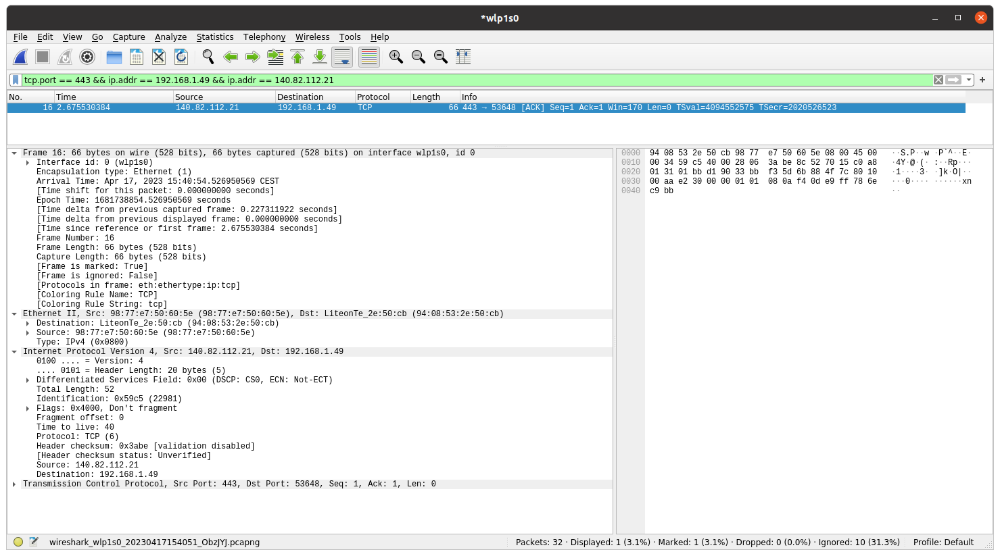
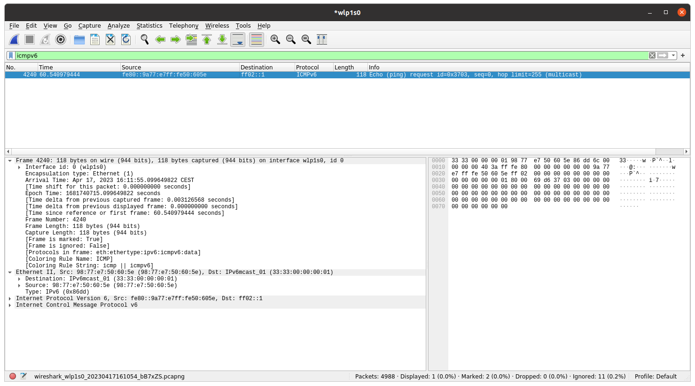

# IPK Project 2

## Network sniffer

## Functionality

The program is a network sniffer that captures packets on a network interface and prints information about them. It uses
the `libpcap` library to capture packets.

It allows users to:

- Specify a network interface to capture packets on.
- Filter packets based on protocol (TCP, UDP, ARP, ICMPv4, ICMPv6, IGMP, MLD).
- Filter packets based on port number for TCP or UDP protocols.
- Specify the number of packets to capture.

The program prints information about each captured packet, including its source and destination IP addresses, protocol,
port number, packet type, and payload.

## Theory

Before diving into the code, it's important to have a basic understanding of the following concepts:

- **Networking protocols:** A protocol is a set of rules that govern the way devices communicate with each other over a
  network. Examples of common networking protocols include TCP, UDP, ARP, ICMPv4, ICMPv6, IGMP, and MLD.
- **Packet headers:** A packet is a unit of data that is transmitted over a network. Each packet has a header that
  contains metadata about the packet, such as the source and destination IP addresses, the protocol used, and the packet
  length.
- **Packet filtering:** Packet filtering is the process of selectively allowing or blocking packets based on certain
  criteria, such as the protocol used, the port number, or the packet type.

In order to extract different types of data from the packets, the program needs to know where to find the relevant
addresses in the packet headers:

- **Time:** The timestamp of the packet is stored in the header of the packet.
- **MAC addresses:** The source and destination MAC addresses are stored in the Ethernet header of the packet.
- **Frame length:** The length of the packet is stored in the header of the packet.
- **IP addresses:** The source and destination IP addresses are stored in the IP header of the packet.
- **Ports:** The source and destination port numbers are stored in the TCP or UDP header of the packet. Note that some
  protocols, such as ARP, ICMPv4, ICMPv6, IGMP, and MLD, do not have port numbers.

## Usage

The program is launched with the following command:

    ./ipk-sniffer [-i interface | --interface interface] {-p port [--tcp|-t] [--udp|-u]} [--arp] [--icmp4] [--icmp6] [--igmp] [--mld] {-n num}

The options are:

- `-i` or `--interface`: specifies the network interface to capture packets on.
- `-p`: specifies the port number to filter packets on.
- `--tcp` or `-t`: filters TCP packets only.
- `--udp` or `-u`: filters UDP packets only.
- `--arp`: filters ARP packets only.
- `--icmp4`: filters ICMPv4 packets only.
- `--icmp6`: filters ICMPv6 echo request/response only.
- `--igmp`: filters IGMP packets only.
- `--mld`: filters MLD packets only.
- `-n`: specifies the number of packets to capture. If not specified, the program will capture one packet. If it is 0,
  the program will capture packets indefinitely.

If there were multiple options specified, the program will output packets that match any of the options. For example,
for

    ./ipk-sniffer -i eth0 -p 80 --tcp --udp --icmp6 -n 10

the program will output packets that match any of the following:

- TCP packets on port 80
- UDP packets on port 80
- ICMPv6 packets

## Testing

The testing was mainly done with the help of Wireshark. Here are some of the tests that were done:

- **Capturing a single TCP packet on port 443 to show that the filters work:**

  Input:

  `./ipk-sniffer -i wlp1s0 --tcp -p 443`

  Expected packet data in the Wireshark:

  

  **Output from the terminal:**

    ```
    timestamp: 2023-04-17T15:40:54.526+02:00
    src mac: 98:77:e7:50:60:5e
    dst mac: 94:08:53:2e:50:cb
    frame length: 66 bytes
    src IP: 140.82.112.21
    dst IP: 192.168.1.49
    src port: 443
    dst port: 53648
    
    0x0000: 94 08 53 2e 50 cb 98 77 e7 50 60 5e 08 00 45 00 ..S.P..w .P`^..E.
    0x0010: 00 34 59 c5 40 00 28 06 3a be 8c 52 70 15 c0 a8 .4Y.@.(. :..Rp...
    0x0020: 01 31 01 bb d1 90 33 bb f3 5d 6b 88 4f 7c 80 10 .1....3. .]k.O|..
    0x0030: 00 aa e2 30 00 00 01 01 08 0a f4 0d e9 ff 78 6e ...0.... ......xn
    0x0040: c9 bb                                           ..
  ```

  Here we can see that the program correctly captured a TCP packet on port 443.
  Everything matches with the packet data from Wireshark screenshot: time, mac addresses, frame length, IP addresses,
  ports and payload data.


- **Capturing an ICMPv6 packet with echo request or response to show different type of output with IPv6 addresses and no
  ports:**

  Input:

  ```./ipk-sniffer -i wlp1s0 --icmp6```

  Expected packet data in the Wireshark:

  

  **Output from the terminal:**

    ```timestamp: 2023-04-17T16:11:55.099+02:00
    src mac: 98:77:e7:50:60:5e
    dst mac: 33:33:00:00:00:01
    frame length: 118 bytes
    src IP: fe80::9a77:e7ff:fe50:605e
    dst IP: ff02::1
    
    0x0000: 33 33 00 00 00 01 98 77 e7 50 60 5e 86 dd 6c 00 33.....w .P`^..l.
    0x0010: 00 00 00 40 3a ff fe 80 00 00 00 00 00 00 9a 77 ...@:... .......w
    0x0020: e7 ff fe 50 60 5e ff 02 00 00 00 00 00 00 00 00 ...P`^.. ........
    0x0030: 00 00 00 00 00 01 80 00 69 d6 37 03 00 00 00 00 ........ i.7.....
    0x0040: 00 00 00 00 00 00 00 00 00 00 00 00 00 00 00 00 ........ ........
    0x0050: 00 00 00 00 00 00 00 00 00 00 00 00 00 00 00 00 ........ ........
    0x0060: 00 00 00 00 00 00 00 00 00 00 00 00 00 00 00 00 ........ ........
    0x0070: 00 00 00 00 00 00                               ......
  ```

  Here as well we can see that the program correctly captured an ICMPv6 packet. Everything matches with the packet data
  from the Wireshark screenshot.

- **Wrong inputs to show how my script handles different errors:**

    - _No device specified:_

      `./ipk-sniffer -p 80`

      Will output:

      `Error: no device specified.`
    - _Invalid device specified:_

      `./ipk-sniffer -i eth1000 -p 80`

      Will output:

      `Error: device eth1000 does not exist.`
    - _Invalid port number:_

      `./ipk-sniffer -i eth0 -p 100000`

      Will output:

      `Error: invalid port number: 100000`

## Sources

Here are some sources that were helpful for understanding `libpcap`:

- [tcpdump tutorial](https://danielmiessler.com/study/tcpdump/)
- [An introduction to libpcap](https://www.tcpdump.org/pcap.html)
- [Using libpcap in C](https://www.devdungeon.com/content/using-libpcap-c)
- [libpcap documentation](https://www.tcpdump.org/manpages/pcap.3pcap.html)
- [pcap-filter man page](https://www.tcpdump.org/manpages/pcap-filter.7.html)
- [lectures from IPK 2022/2023](https://moodle.vut.cz/mod/folder/view.php?id=289124)